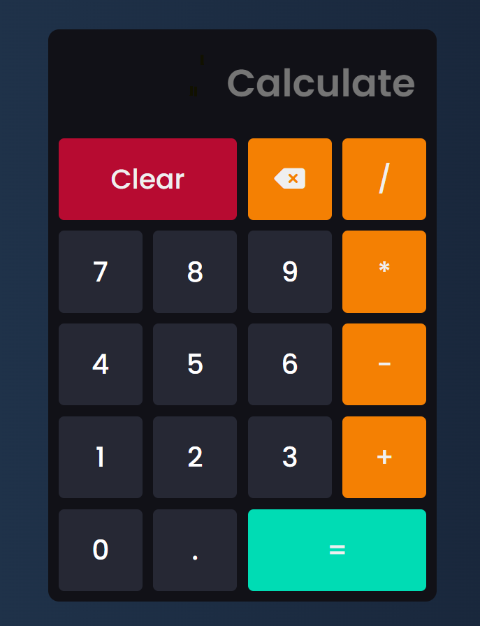

# Frontend-React-Calculator # 

I create calculator app with react (JavaScript framework)

## Description

I do this project with react hooks (State)
Simply it calculate result with (eval)

## REQUIREMENT

You only need node js and command line too

## USAGE

1. run command `cd .\Frontend-React-Calculator\`
2. install modules `npm i`
3. start on local server `npm run start`
4. also you can get production version `npm run build`

## PREVIEW

.gitignore removed node_modules/
